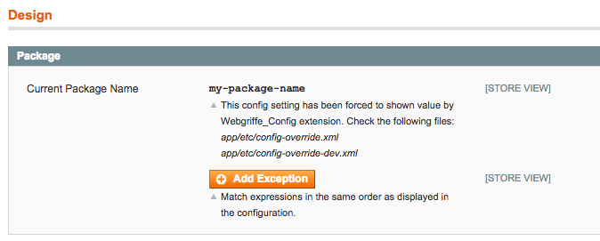

Webgriffe Config
================

Magento extension that improves config system.
Work in progress....

Installation
------------

Please, use [Magento Composer Installer](https://github.com/magento-hackathon/magento-composer-installer) and add `webgriffe/config-extension` to your dependencies. Also add this repository to your `composer.json`.

	"repositories": [
        {
            "type": "vcs",
            "url": "git@github.com:webgriffe/config-extension.git"
        }
    ]
    
Then you have to enable in your Magento installation the improved Config Model. To do so, edit your `index.php` and define `config_model` option during `Mage::run()`:

	Mage::run($mageRunCode, $mageRunType, array('config_model' => 'Webgriffe_Config_Model_Config'));

Config override
---------------

Magento configuration is driven by database. This, sometimes, is overkill and forces us to maintain upgrade script to keep Magento envorinment aligned with features development.
So, this extension enables additional config file that overrides database configuration. The file must be at path `app/etc/config-override.xml`. For example:

	<?xml version="1.0"?>
	<config>
    	<default>
        	<general>
            	<locale>
                	<code>en_US</code>
	            </locale>
    	    </general>
	    </default>
	    <stores>
	    	<it_it>	    			
    			<general>
            		<locale>
        	        	<code>it_IT</code>
		            </locale>
	    	    </general>
	    	</it_it>
	    </stores>
	</config>
	
Environment specific config
---------------------------

You can set different config based on current environment by defining several environment config files that must be placed in `app/etc` and must be named with the pattern `config-override-{env}.xml` where `{env}` is the current environment (for example `config-override-dev.xml` for `dev` environment or `config-override-prod.xml` for `prod` environment). Environment specific config ovverrides `app/etc/config-override.xml` config explained above. To specify the current environment you must set the environment variable `MAGE_ENVIRONMENT`. For example in Apache virtual host configuration or in the `.htaccess`file you can do:

	SetEnv MAGE_ENVIRONMENT "dev"
	

Base config (local.xml) override
--------------------------------

This extension allows to override base Magento configuration (local.xml config). Base config override is also environment specific. You must put a `local-override-{env}.xml` file in `app/etc` and this will override your `local.xml` file. This can be useful for full acceptance testing on a different database. For example you can have the following file in `app/etc/local-override-test.xml`:

	<?xml version="1.0"?>
	<config>
    	<global>
        	<resources>
            	<default_setup>
                	<connection>
                   		<dbname><![CDATA[my-project-test]]></dbname>
	               </connection>
    	       </default_setup>
        	</resources>
	    </global>
	</config>
	
Doing so, for the `test` environment, Magento will use `my-project-test` database with the same credentials specified in the `local.xml` file.
Then using a library like [CgiHttpKernel](https://github.com/igorw/CgiHttpKernel) you can do full acceptance (or functional testing) on a test-dedicated database.

Overridden config values are shown in backend
---------------------------------------------

Overridden config values are shown in Magento's backend. Every config setting it's shown on its section. For example, if you have the following `config-override.xml` file:

	<?xml version="1.0"?>
	<config>
    	<default>
        	<design>
            	<package>
                	<name>my-package-name</name>
	            </package>
    	    </design>
	    </default>
	</config>

When you'll go to `System -> Configuration -> General -> Design` you'll find the overridden config value shown and not editable.

This feature improves a lot the usability of this extension.

To Do
-----

* [EcomDev_PHPUnit](https://github.com/EcomDev/EcomDev_PHPUnit) integration: when running tests with EcomDev\_PHPUnit the Webgriffe\_Config model will not work because EcomDev replaces the config model with its own. We're working on a separate bridge extension that integrates EcomDev\_PHPUnit with Webgriffe\_Config.
* [n98-magerun](https://github.com/netz98/n98-magerun) integration?
* Performance improvements.

